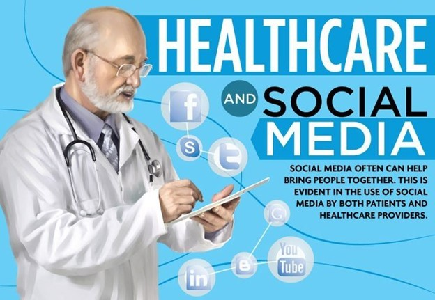
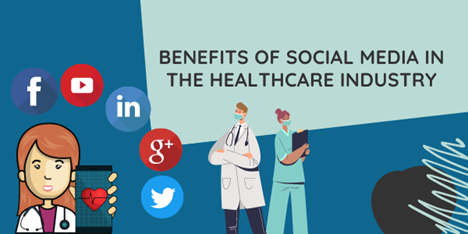
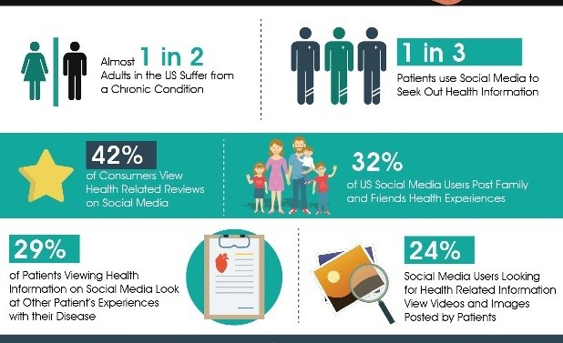
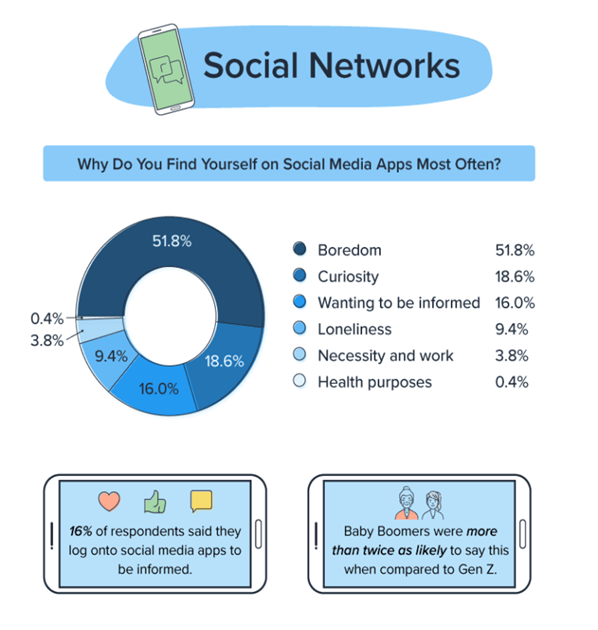

# The Internet and Social Media In Health Arena

## Internet and social media's reflection in healthcare:
 Web-based entertainment matters across ventures and medical care is no exemption. As additional individuals have become dynamic via web-based entertainment, the clinical field has embraced it and presently integrates online entertainment into various medical care methodologies. Healthcare organizations and medical institutions are aware of how social media influences the connection between patients and doctors as well as how it affects health informatics systems. As per Worldwide Telecom Association (ITU) somewhere in the range of 56% and 79% of clients get wellbeing data online in the US. A previous investigation discovered that 47% of the South Asian populace in Canada look for the Web for acquiring wellbeing data. The rise of telemedicine and online consultations have made healthcare more accessible for many people. The COVID-19 pandemic has accelerated the adoption of digital health solutions, as in-person visits became more difficult and riskier. These stages and web indexes were a helpful method for speaking with specialists all over the planet and to figure out the reasons for their side effects.

## Social media sites for healthcare professionals: 
As person-to-person communication has developed; therapeutically engaged proficient networks have been laid out. These organizations are in many cases private and safeguarded from nonmembers, like the lay public and even individuals from other wellbeing callings. Money sources for these destinations change, with monetary help frequently being given by proficient affiliations, publicizing or information deals, research subsidizing, and drug organizations.

Sermo is a platform for licensed physicians to connect and engage in discussions related to medicine and healthcare. The platform ensures that only qualified physicians can participate in discussions and provides a rating system for evaluating the credibility of posts.
Doximity is a more current "physician-only" long range interpersonal communication local area that offers text and pictures that are consistent with the health care coverage Movability and Responsibility Act (HIPAA), which permits reason behind care data publicly supporting.
The Medical Directors Forum is a social networking site for medical directors that provides a secure and verified platform for peer-to-peer communication. The site likewise gives devoted bunch pages to clinical chiefs working in many areas, including: clinic, veterans issues, Federal medical insurance, bunch practice, business, social wellbeing, oversaw care, restorative office, and long-haul care. The not-for-profit Understudy Specialist Organization is a well-known social local area site for undergrad and rehearsing doctors, dental specialists, and veterinarians in the U.S. also Canada. To protect the privacy of their users, they do not permit extensive user profiles or "friending" and instead promote anonymity.

## Benefits of social media in the Healthcare Industry

 
Having a web-based entertainment presence is critical in light of the fact that one supplier can arrive at relatives and companions of their representatives and patients. There are different expert motivations to utilize virtual entertainment, for example:
1.	Patients Uses social media sites:
 Approximately 80% of patients conducted at least one healthcare-related search on the internet in the past year. Associations frequently find that around 63% of individuals picked one supplier in view of areas of strength for them presence. The idea is to reach your patients through their virtual entertainment feed. There are worries about web-based entertainment in medical services, the vast majority like having command over their lives and the advantages they get. In any case, every association should zero in on the business part of their medical services practice.

2.	 Easily build Relationship with Patients:
As indicated by an overview directed for the American Osteopathic Affiliation (AOA), about 42% of grown-ups need to follow their medical care proficient on a virtual entertainment stage like Twitter or Facebook. 
Patients feel that the web is the spot to go to associate with their companions as a whole. Doctors and other wellbeing representatives can make remarks, post data, and notice other medical services offices to get all interested parties.
3.	 Cost-effective Marketing:
Starting an in-house healthcare social media marketing campaign doesn't require any initial investment. A doctors' training that has major areas of strength for a presence can instruct individuals and post supportive data on the web. They can advance their wellbeing, however they spread the news about new medical problems, concerns, and choices.
4.	Displaying accomplishments and events through social media platforms.
Patients need to realize that their PCPs and medical attendants are engaged with the local area. One might say, online entertainment breaks the ties that tight spot, permitting everybody to participate. With that, potential patients can utilize online entertainment to figure out more data about the actual association. 

## Drawbacks of social media in healthcare:

 

Although there are many advantages of having a virtual entertainment presence, it's not all silly buffoonery. There are really many cons of online entertainment in medical services. Here are only a couple of things to look for:
1. Security Risks:
Quite possibly of the greatest trepidation virtual entertainment clients have been that their confidential data could get taken. Toward the start of 2018, a bigger number of than 56% of the compromised information records (over 4.5 billion of them) were from web-based entertainment issues. Patient security is something that everybody should zero in on, particularly the medical care supplier.

2. False Information:
A great many people stress over bogus data springing up in medical services web-based entertainment showcasing strategies, and it happens a lot. It really requires six attempts as lengthy for reality to contact 1,500 individuals as it does misrepresentations. The soundness of your patients is in question here, and web-based entertainment is known for advancing conflicting data.
Around three-fourths of the top wellbeing stories in 2018 contained bogus data or were deluding. The vast majority via virtual entertainment center exclusively around the title and don't for even a moment read the substance. This implies misleading data is 70% bound to be shared than reality.

3. The healthcare professional's lack of control:
One more disadvantage of online entertainment in medical services is the absence of control you have. It's basically impossible to keep pessimistic remarks from springing up on the things you share, and every individual's web-based entertainment feed shows these things.

4. Time consuming:
Having an online entertainment presence isn't simple since it's a tedious undertaking. Regardless of whether you just utilize a couple of online entertainment accounts, you should deliver new satisfied constantly and make all the difference for the buzz. More channels eventually request additional time, yet your medical services experts are as of now extended far, particularly in this day and age. Additionally, the outcomes are not prompt. There are so many other medical care offices viewing for the hour of every client of online entertainment, so the battle of being the best never completely disappears.

 
## Conclusion: 
The use of social media sites and platforms can promote personal and public health, as well as professional growth, when used wisely and carefully. However, when not used with caution, these technologies can pose significant risks to healthcare providers Health care organizations and professional societies have issued guidelines to provide practical and useful principles for healthcare providers to follow to avoid potential dangers.

### References: 
Internet and Social media reflection
* https://onlinemasters.ohio.edu/blog/social-media-in-healthcare/
* https://www.cureus.com/articles/65583-the-use-of-internet-and-social-media-for-health-information-and-its-consequences-among-the-population-in-saudi-arabia#!/
Social medica sites for healthcare professionals
* https://www.ncbi.nlm.nih.gov/pmc/articles/PMC4103576/
Benefits
* https://digitalismedical.com/blog/pros-and-cons-of-social-media-in-healthcare/
* https://i.pinimg.com/originals/f2/a7/af/f2a7afd070143237537e3f80185db886.jpg

